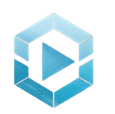
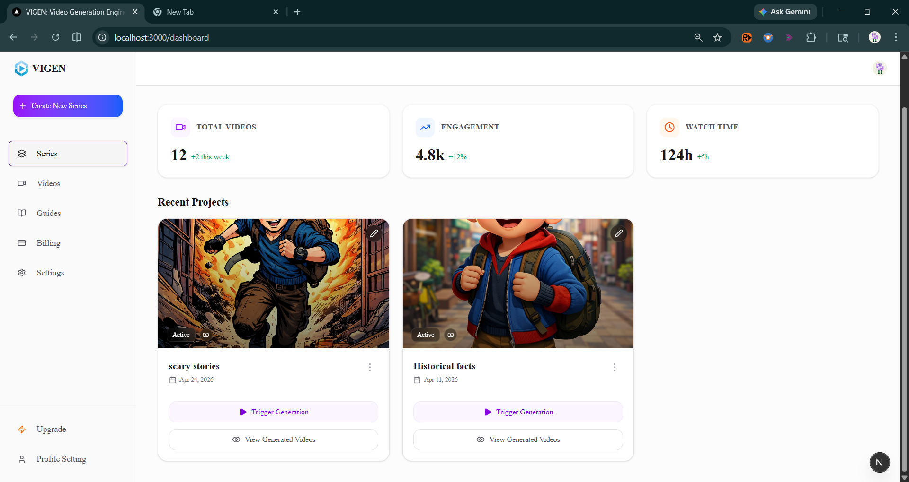

<div align="center">
  
  
  # VIGEN – AI Video Generation & Distribution Engine

  <p align="center">
    <strong>Turn Text into Viral Video Content. Fully Automated.</strong>
  </p>

  <p align="center">
    
    
    
    
    
  </p>
</div>

---

## 🌟 Overview

**VIGEN** is an intelligent, full-stack video generation and scheduling platform designed to automate the creation and distribution of short-form video content. It bridges the gap between idea and execution by transforming simple text scripts into engaging, highly-polished videos, and schedules them for seamless cross-platform posting.

Whether you are a content creator, marketer, or agency, VIGEN puts your video content pipeline on autopilot.

<div align="center">
  <!-- Note: Replace the URL below with a real screenshot or GIF of the dashboard once available -->
  
</div>

---

## ✨ Key Features

### 🎬 AI Video Generation Pipeline
- **Text-to-Video**: Automatically converts textual prompts and concepts into rich video content.
- **Scene-by-Scene Assembly**: Dynamically generates and sequences video assets, splitting your script into individual scenes.
- **Lifelike Voiceovers**: Integrates with cutting-edge AI TTS (Text-to-Speech) to generate human-like narrations.

### 📅 Multi-Platform Scheduling
- **One-Click Publishing**: Connect and schedule videos to be posted automatically to **TikTok, YouTube Shorts, and Instagram Reels**.
- **OAuth Integration**: Securely link your social media accounts via official developer APIs.

### 🎨 Editor & Review Studio
- **Visual Review Interface**: A dedicated dashboard to review generated video scenes, scripts, images, and voiceovers.
- **Granular Control**: Don't like a specific scene? Upload custom images, rewrite a specific line, or ask the AI to regenerate the visual asset.
- **Perfect Syncing**: The timeline perfectly syncs captions, voiceovers, and transitions dynamically using **Remotion**.

### 🗂️ Workflow Management
- **Series Organization**: Group related videos into thematic series (e.g., "Daily Tech News", "Motivation Mondays").
- **Background Processing**: Heavy rendering and API polling are offloaded to robust background jobs via **Inngest**.

---

## 🛠️ Technology Stack

VIGEN is built on a modern, robust, and scalable tech stack:

- **Frontend**: [Next.js 16](https://nextjs.org/) (App Router), [React 19](https://react.dev/), [TypeScript](https://www.typescriptlang.org/), [Tailwind CSS 4](https://tailwindcss.com/)
- **UI Components**: [shadcn/ui](https://ui.shadcn.com/), [Lucide Icons](https://lucide.dev/)
- **Video Rendering**: [Remotion](https://www.remotion.dev/) (React-based programmatic video rendering)
- **Authentication**: [Clerk](https://clerk.com/)
- **Database & Auth**: [Supabase](https://supabase.com/) (PostgreSQL)
- **Background Jobs**: [Inngest](https://www.inngest.com/)
- **AI/ML Services**: 
  - **Image Generation**: [Replicate](https://replicate.com/) (SDXL/Flux models)
  - **Voice & Scripting**: [OpenAI](https://openai.com/) API / [Google Gemini](https://deepmind.google/technologies/gemini/)

---

## 🚀 Getting Started

Follow these steps to set up the VIGEN platform locally.

### Prerequisites

- **Node.js**: v18.17 or higher
- **PostgreSQL**: A running instance (or a Supabase project)
- **API Keys**: You will need keys for Clerk, Supabase, OpenAI, Replicate, and Inngest.

### Installation

1. **Clone the repository**
   ```bash
   git clone https://github.com/krrishnagupta/VIGEN---Video-Generation-Engine
   cd vigen
   ```

2. **Install dependencies**
   ```bash
   npm install
   ```

3. **Environment Setup**
   Create a `.env.local` file in the root directory and add the following variables:
   ```env
   # Authentication (Clerk)
   NEXT_PUBLIC_CLERK_PUBLISHABLE_KEY=pk_test_...
   CLERK_SECRET_KEY=sk_test_...

   # Database (Supabase)
   NEXT_PUBLIC_SUPABASE_URL=https://your-project.supabase.co
   NEXT_PUBLIC_SUPABASE_ANON_KEY=eyJhb...
   SUPABASE_SERVICE_ROLE_KEY=eyJhb...

   # AI Services
   OPENAI_API_KEY=sk-...
   REPLICATE_API_TOKEN=r8_...

   # Background Jobs
   INNGEST_EVENT_KEY=local
   INNGEST_SIGNING_KEY=local
   ```

4. **Start the development server**
   ```bash
   npm run dev
   ```
   Open [http://localhost:3000](http://localhost:3000) to view the application.

---

## 📖 Usage Guide

1. **Onboard & Connect**: Create an account via Clerk and navigate to the **Settings** page to connect your social media platforms.
2. **Create a Series**: Navigate to the **Create** tab, select a video style (e.g., Cinematic, Watercolor), pick a voice, and describe your concept.
3. **Trigger Generation**: Our background workers will draft the script, voice, and visuals.
4. **Review & Refine**: Check the **Review** screen to adjust any specific scene image or script line. 
5. **Publish**: Once approved, the final MP4 is rendered via Remotion and automatically dispatched to your connected channels!

---

## 📝 License

This project is licensed under the [MIT License](LICENSE).

---

<div align="center">
  <i>Crafted with ❤️ for the future of automated content creation.</i>
</div>
